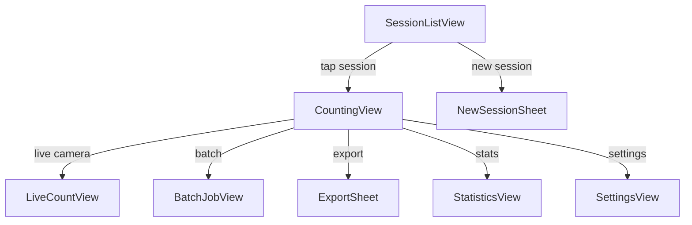
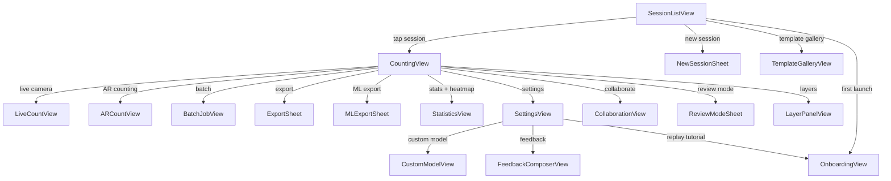

# Design Document: OpenCount iOS

## Overview

OpenCount is a native iOS application built with SwiftUI and the MVVM architecture pattern. It provides on-device AI-powered object counting using Apple's Vision framework and CoreML, combined with manual tap-to-count, region-of-interest filtering, live camera counting, batch processing, and multi-format export. All data is stored locally using SwiftData, with optional iCloud sync via CloudKit.

The app targets iOS 16.0+ and is distributed as a free, open-source project under the MIT license. It runs entirely offline; no backend server is required for any core feature.

---

## Architecture

### Pattern: MVVM + Coordinator

```
┌─────────────────────────────────────────────────────────────┐
│                        SwiftUI Views                        │
│  SessionListView  CountingView  LiveCountView  ExportView   │
└──────────────────────────┬──────────────────────────────────┘
                           │ @StateObject / @ObservedObject
┌──────────────────────────▼──────────────────────────────────┐
│                      ViewModels                             │
│  SessionListVM  CountingVM  LiveCountVM  ExportVM           │
└──────────────────────────┬──────────────────────────────────┘
                           │ async/await
┌──────────────────────────▼──────────────────────────────────┐
│                      Services Layer                         │
│  CountingService  AIService  ExportService  StorageService  │
└──────────────────────────┬──────────────────────────────────┘
                           │
┌──────────────────────────▼──────────────────────────────────┐
│                   Data / Infrastructure                     │
│  SwiftData (local)   CloudKit (sync)   CoreML/Vision (AI)   │
└─────────────────────────────────────────────────────────────┘
```

### Navigation

The app uses a `NavigationStack`-based coordinator. The root is `SessionListView`. Tapping a session pushes `CountingView`. The live camera and batch screens are presented as full-screen covers.



---

## Components and Interfaces

### 1. SessionListViewModel

Manages the list of sessions, search filtering, and session CRUD.

```swift
@MainActor
final class SessionListViewModel: ObservableObject {
    @Published var sessions: [CountSession] = []
    @Published var searchQuery: String = ""
    @Published var filteredSessions: [CountSession] = []

    func createSession(name: String, description: String?) async throws -> CountSession
    func deleteSession(_ session: CountSession) async throws
    func duplicateSession(_ session: CountSession) async throws -> CountSession
    func search(query: String) // debounced, updates filteredSessions within 300ms
}
```

### 2. CountingViewModel

The central ViewModel for an active counting session. Coordinates manual counting, AI detection, region management, undo/redo, and real-time tally computation.

```swift
@MainActor
final class CountingViewModel: ObservableObject {
    @Published var session: CountSession
    @Published var selectedObjectType: ObjectType?
    @Published var markers: [CountMarker] = []
    @Published var detections: [AIDetection] = []
    @Published var regions: [CountRegion] = []
    @Published var confidenceThreshold: Float = 0.5
    @Published var isGridOverlayEnabled: Bool = false
    @Published var gridDensity: Int = 5
    @Published var isAIRunning: Bool = false
    @Published var aiProgress: Double = 0.0

    // Manual counting
    func placeMarker(at point: CGPoint, in imageSize: CGSize) 
    func removeMarker(_ marker: CountMarker)
    func undo()
    func redo()

    // AI counting
    func runAIDetection(on image: UIImage) async throws
    func acceptDetection(_ detection: AIDetection)
    func acceptAllDetections()
    func deleteDetection(_ detection: AIDetection)
    func reassignMarker(_ marker: CountMarker, to objectType: ObjectType)

    // Region management
    func addRegion(_ region: CountRegion)
    func updateRegion(_ region: CountRegion)
    func deleteRegion(_ region: CountRegion)
    func tally(for region: CountRegion) -> [ObjectType: Int]

    // Computed
    var globalTally: [ObjectType: Int]
    var filteredDetections: [AIDetection] // filtered by confidenceThreshold
}
```

### 3. AIService

Wraps the CoreML/Vision pipeline. Responsible for loading the model, running inference, and returning structured results.

```swift
protocol AIServiceProtocol {
    func detect(in image: UIImage, confidenceThreshold: Float) async throws -> [AIDetection]
    func detectSimilar(to sample: CGRect, in image: UIImage) async throws -> [AIDetection]
}

final class CoreMLAIService: AIServiceProtocol {
    private let model: VNCoreMLModel  // YOLOv8-nano.mlpackage
    
    func detect(in image: UIImage, confidenceThreshold: Float) async throws -> [AIDetection]
    func detectSimilar(to sample: CGRect, in image: UIImage) async throws -> [AIDetection]
}
```

The model is bundled in the app target as `YOLOv8n.mlpackage`. Inference runs on a background actor to avoid blocking the main thread.

### 4. LiveCountViewModel

Manages the AVCaptureSession pipeline for live camera counting.

```swift
@MainActor
final class LiveCountViewModel: ObservableObject {
    @Published var liveDetections: [AIDetection] = []
    @Published var isFrozen: Bool = false
    @Published var frozenFrame: UIImage?
    @Published var confidenceThreshold: Float = 0.5

    func startSession()
    func stopSession()
    func freeze() // captures current frame, sets isFrozen = true
    func switchCamera()
    func saveFrameToSession(_ session: CountSession) async throws
}
```

### 5. ExportService

Handles all export formats. Each export method is a pure transformation from session data to a file or string.

```swift
protocol ExportServiceProtocol {
    func exportCSV(session: CountSession) throws -> Data
    func exportJSON(session: CountSession) throws -> Data
    func exportAnnotatedImage(session: CountSession, image: UIImage) throws -> UIImage
    func exportPDF(session: CountSession, image: UIImage) throws -> Data
    func plainTextSummary(session: CountSession) -> String
}
```

### 6. StorageService

Thin wrapper around SwiftData's `ModelContext` and `ModelContainer`.

```swift
protocol StorageServiceProtocol {
    func save(_ session: CountSession) async throws
    func delete(_ session: CountSession) async throws
    func fetchAllSessions() async throws -> [CountSession]
    func fetchSessions(matching query: String) async throws -> [CountSession]
}
```

### 7. UndoStack

A generic, value-type undo/redo stack used by `CountingViewModel`.

```swift
struct UndoStack<T> {
    private var undoHistory: [T] = []
    private var redoHistory: [T] = []
    let capacity: Int  // default 50

    mutating func push(_ state: T)
    mutating func undo(currentState: T) -> T?
    mutating func redo(currentState: T) -> T?
    var canUndo: Bool
    var canRedo: Bool
}
```

---

## Data Models

All persistent models use SwiftData `@Model` macro.

```swift
@Model
final class CountSession {
    var id: UUID
    var name: String
    var sessionDescription: String?
    var createdAt: Date
    var modifiedAt: Date
    var objectTypes: [ObjectType]
    var images: [SessionImage]
    var regions: [CountRegion]
    var markers: [CountMarker]
    var videoTimestamps: [VideoFrameCount]
}

@Model
final class ObjectType {
    var id: UUID
    var name: String
    var colorHex: String       // e.g. "#FF5733"
    var iconName: String       // SF Symbol name
    var sortOrder: Int
    var session: CountSession?
}

@Model
final class CountMarker {
    var id: UUID
    var normalizedX: Double    // 0.0–1.0 relative to image width
    var normalizedY: Double    // 0.0–1.0 relative to image height
    var objectType: ObjectType
    var isAIDerived: Bool      // true if converted from AI_Detection
    var createdAt: Date
    var session: CountSession?
    var regionID: UUID?        // optional: which region this marker was placed in
}

@Model
final class CountRegion {
    var id: UUID
    var name: String
    var colorHex: String
    var shapeType: RegionShapeType  // .rectangle, .ellipse, .polygon
    var normalizedPoints: [CGPoint] // polygon vertices or rect corners in normalized coords
    var session: CountSession?
}

@Model
final class SessionImage {
    var id: UUID
    var filename: String       // stored in app's Documents directory
    var thumbnailFilename: String?
    var importedAt: Date
    var session: CountSession?
}

@Model
final class VideoFrameCount {
    var id: UUID
    var timestampSeconds: Double
    var markers: [CountMarker]
    var session: CountSession?
}

// Non-persistent (in-memory only)
struct AIDetection: Identifiable, Equatable {
    let id: UUID
    let normalizedBoundingBox: CGRect  // normalized 0.0–1.0
    let label: String
    let confidenceScore: Float
    var isAccepted: Bool
}

enum RegionShapeType: String, Codable {
    case rectangle
    case ellipse
    case polygon
}
```

### Persistence Strategy

- **SwiftData** stores all `@Model` entities in a SQLite database at the default app container path.
- **Images** are stored as files in the app's `Documents/images/` directory; only filenames are stored in SwiftData.
- **CloudKit** sync is enabled by configuring the `ModelContainer` with a `CloudKitDatabase` when the user opts in.
- **UserDefaults** stores lightweight preferences (marker size, default threshold, etc.).

---

## Correctness Properties

*A property is a characteristic or behavior that should hold true across all valid executions of a system — essentially, a formal statement about what the system should do. Properties serve as the bridge between human-readable specifications and machine-verifiable correctness guarantees.*

### Property 1: Marker placement increments tally by exactly one

*For any* counting session with any selected Object_Type and any valid tap location, placing a Count_Marker SHALL increase the Tally for that Object_Type by exactly 1 and leave all other Object_Type Tallies unchanged.

**Validates: Requirements 3.1, 6.1**

---

### Property 2: Undo/redo round-trip restores original state

*For any* sequence of marker placement and deletion operations, applying undo for each operation in reverse order SHALL restore the session to its exact original state (same markers, same tallies).

**Validates: Requirements 3.5, 3.6**

---

### Property 3: Confidence threshold filtering is monotone

*For any* set of AI_Detections and any two threshold values T1 < T2, the set of detections displayed at threshold T2 SHALL be a subset of the detections displayed at threshold T1 (raising the threshold never adds detections).

**Validates: Requirements 5.5, 5.6**

---

### Property 4: Region tally equals contained marker count

*For any* Region geometry and any set of Count_Markers, the Region Tally for a given Object_Type SHALL equal the number of Count_Markers of that Object_Type whose normalized coordinates fall strictly within the Region's boundary.

**Validates: Requirements 8.5, 8.7**

---

### Property 5: CSV export round-trip preserves session data

*For any* valid CountSession, serializing it to CSV and parsing the CSV back SHALL produce a data structure with the same Object_Type names, Tallies, and Count_Marker coordinates as the original session.

**Validates: Requirements 12.1**

---

### Property 6: JSON export round-trip preserves session data

*For any* valid CountSession, serializing it to JSON and deserializing the JSON back SHALL produce a CountSession value that is structurally equivalent to the original (same id, name, objectTypes, markers, regions).

**Validates: Requirements 12.2**

---

### Property 7: Object_Type deletion removes all associated markers

*For any* CountSession and any Object_Type within that session, after deleting the Object_Type, the session SHALL contain zero Count_Markers associated with that Object_Type and the Tally for that type SHALL be 0.

**Validates: Requirements 14.5**

---

### Property 8: Session persistence round-trip preserves state

*For any* CountSession state (including all markers and regions), persisting the session to SwiftData and then fetching it back SHALL produce a session that is structurally equivalent to the original.

**Validates: Requirements 18.5, 1.3**

---

### Property 9: Combined tally equals manual plus AI-derived marker count

*For any* CountSession, the global Tally for each Object_Type SHALL equal the total number of Count_Markers (both manually placed and AI-derived) of that Object_Type in the session.

**Validates: Requirements 7.4, 3.7**

---

### Property 10: Session search returns only matching sessions

*For any* list of CountSessions and any non-empty search query, the filtered result SHALL contain only sessions whose name contains the query string (case-insensitive), and SHALL contain all such sessions.

**Validates: Requirements 1.6**

---

## Error Handling

| Scenario | Handling Strategy |
|---|---|
| AI inference out-of-memory | Catch `VNError`, display alert with retry and "switch to manual" options |
| CoreML model load failure | Fall back gracefully; disable AI features; show banner |
| Photo/camera permission denied | Show actionable alert deep-linking to iOS Settings |
| iCloud sync failure | Log error, continue with local data, retry on next foreground |
| Image file missing on disk | Show placeholder, offer re-import option |
| SwiftData save failure | Show error toast, attempt retry; never silently discard data |
| Export write failure (disk full) | Show specific "Not enough storage" alert |
| Video frame extraction failure | Skip frame, log warning, continue with next frame |

All errors are modeled as typed `enum AppError: LocalizedError` cases and surfaced through the ViewModel's `@Published var error: AppError?` property, which triggers an `.alert` modifier in the View layer.

---

## Testing Strategy

### Dual Testing Approach

Unit tests and property-based tests are complementary. Unit tests cover specific examples and edge cases; property-based tests verify universal correctness across a wide input space.

### Property-Based Testing

The project uses **SwiftCheck** (a Swift port of QuickCheck) for property-based testing.

Each property test:
- Runs a minimum of **100 iterations** with randomly generated inputs
- Is tagged with a comment referencing the design property number
- Uses `Arbitrary` instances for `CountSession`, `CountMarker`, `ObjectType`, `CountRegion`, and `AIDetection`

Tag format: `// Feature: open-count-ios, Property N: <property_text>`

### Unit Tests

Unit tests cover:
- Specific examples for `UndoStack` operations
- Edge cases: empty session, zero markers, single Object_Type
- Error conditions: invalid image format, model load failure
- Integration points between `CountingViewModel` and `StorageService`

### UI Tests (XCUITest)

- Smoke test: app launches and displays session list
- End-to-end: create session → place markers → export CSV → verify file exists
- Accessibility: VoiceOver traversal of counting screen

### Test Targets

| Target | Framework | Scope |
|---|---|---|
| `OpenCountTests` | XCTest + SwiftCheck | Unit + property tests for services and view models |
| `OpenCountUITests` | XCUITest | UI smoke and end-to-end flows |

### PBT Configuration

```swift
// Minimum iterations per property
SwiftCheck.checkConfig = CheckerArguments(maxAllowableSuccessfulTests: 100)
```

---

## Extended Components (Requirements 19–28)

### 8. ARCountViewModel

Manages the ARKit session for augmented reality counting.

```swift
@MainActor
final class ARCountViewModel: ObservableObject {
    @Published var arAnchors: [ARCountAnchor] = []
    @Published var isARSupported: Bool = false
    @Published var selectedObjectType: ObjectType?

    func startARSession()
    func stopARSession()
    func placeAnchor(at raycastResult: ARRaycastResult)
    func removeAnchor(_ anchor: ARCountAnchor)
    func captureSnapshot() async -> UIImage?
    func saveToSession(_ session: CountSession) async throws
    var globalTally: [ObjectType: Int]
}

struct ARCountAnchor: Identifiable {
    let id: UUID
    let worldTransform: simd_float4x4
    let objectType: ObjectType
    let distanceMeters: Float
    let createdAt: Date
}
```

### 9. CustomModelService

Handles import, validation, and switching of CoreML models.

```swift
protocol CustomModelServiceProtocol {
    func importModel(from url: URL) async throws -> ModelMetadata
    func validateModel(at url: URL) throws -> ModelMetadata
    func activateModel(_ metadata: ModelMetadata) throws -> VNCoreMLModel
    func listImportedModels() -> [ModelMetadata]
    func deleteModel(_ metadata: ModelMetadata) throws
}

struct ModelMetadata: Codable, Identifiable {
    let id: UUID
    let name: String
    let filename: String
    let inputSize: CGSize
    let classLabels: [String]
    let importedAt: Date
}
```

### 10. MLExportService

Produces COCO JSON and YOLO TXT annotation exports.

```swift
protocol MLExportServiceProtocol {
    func exportCOCO(session: CountSession, images: [UIImage]) throws -> Data
    func exportYOLO(session: CountSession, images: [UIImage]) throws -> URL  // ZIP
    func exportTrainingSplit(
        session: CountSession,
        images: [UIImage],
        trainRatio: Double,
        valRatio: Double,
        testRatio: Double
    ) throws -> URL  // ZIP with train/val/test folders
}
```

### 11. HeatmapRenderer

Computes and renders a kernel density estimation heatmap over the image canvas.

```swift
final class HeatmapRenderer {
    func render(
        markers: [CountMarker],
        imageSize: CGSize,
        radius: CGFloat,
        objectTypeFilter: ObjectType?
    ) -> UIImage  // RGBA heatmap overlay, same size as image

    // Uses Metal for GPU-accelerated KDE computation
    private func computeKDE(points: [CGPoint], radius: CGFloat, outputSize: CGSize) -> MTLTexture
}
```

### 12. WatchConnectivityService

Bridges the iOS app and watchOS companion via WatchConnectivity.

```swift
final class WatchConnectivityService: NSObject, WCSessionDelegate, ObservableObject {
    @Published var isWatchReachable: Bool = false
    @Published var pendingSyncCount: Int = 0

    func sendSessionUpdate(_ session: CountSession)
    func receiveCountIncrement(objectTypeID: UUID, sessionID: UUID) async
    func flushPendingIncrements() async
}
```

### 13. AppIntentsProvider

Exposes OpenCount actions to Siri and the Shortcuts app via App Intents framework.

```swift
struct CreateSessionIntent: AppIntent {
    static var title: LocalizedStringResource = "Create Counting Session"
    @Parameter(title: "Session Name") var name: String
    func perform() async throws -> some IntentResult & ReturnsValue<String>
}

struct GetTallyIntent: AppIntent {
    static var title: LocalizedStringResource = "Get Count Tally"
    @Parameter(title: "Session") var sessionID: String
    @Parameter(title: "Object Type") var objectTypeName: String?
    func perform() async throws -> some IntentResult & ReturnsValue<Int>
}

struct ExportSessionIntent: AppIntent {
    static var title: LocalizedStringResource = "Export Session"
    @Parameter(title: "Session") var sessionID: String
    @Parameter(title: "Format") var format: ExportFormatEntity
    func perform() async throws -> some IntentResult & ReturnsValue<IntentFile>
}
```

### 14. CollaborationService

Manages CloudKit sharing for collaborative sessions.

```swift
final class CollaborationService: ObservableObject {
    @Published var participants: [SessionParticipant] = []
    @Published var shareURL: URL?

    func createShare(for session: CountSession) async throws -> URL
    func joinSession(shareURL: URL) async throws -> CountSession
    func revokeAccess(for participant: SessionParticipant) async throws
    func syncMarker(_ marker: CountMarker, operation: MarkerOperation) async throws
}

struct SessionParticipant: Identifiable {
    let id: UUID
    let name: String
    let initials: String
    var isOnline: Bool
    let role: ParticipantRole  // .owner, .editor
}

enum MarkerOperation {
    case add(CountMarker)
    case remove(UUID)
}
```

---

## Updated Navigation Graph



---

## Additional Correctness Properties

### Property 11: AR anchor tally equals placed anchor count

*For any* AR session, the Tally for each Object_Type SHALL equal the number of AR anchors of that type currently active in the scene.

**Validates: Requirements 19.2**

---

### Property 12: Heatmap renders without markers being lost

*For any* set of Count_Markers, toggling the Density_Heatmap on and off SHALL leave the Count_Markers array unchanged (heatmap is a pure rendering overlay).

**Validates: Requirements 24.2**

---

### Property 13: COCO export contains all accepted detections

*For any* CountSession with AI-derived markers, the COCO JSON export SHALL contain one annotation entry per AI-derived CountMarker, with bounding box coordinates that round-trip within floating-point precision.

**Validates: Requirements 21.1**

---

### Property 14: Collaborative sync preserves total marker count

*For any* two participants each adding N and M markers respectively to a shared session, after sync the session SHALL contain exactly N + M markers with no duplicates.

**Validates: Requirements 28.2, 28.5**

---

---

## Extended Components (Requirements 29–35)

### 15. OnboardingCoordinator

Manages first-run onboarding flow and per-feature coach marks.

```swift
final class OnboardingCoordinator: ObservableObject {
    @AppStorage("hasSeenOnboarding") var hasSeenOnboarding: Bool = false
    @AppStorage("seenCoachMarks") private var seenCoachMarksData: Data = Data()

    var seenCoachMarks: Set<CoachMarkKey> { get set }

    func markOnboardingComplete()
    func shouldShowCoachMark(for key: CoachMarkKey) -> Bool
    func dismissCoachMark(_ key: CoachMarkKey)
    func resetOnboarding()  // called from Settings "Replay Tutorial"
}

enum CoachMarkKey: String, CaseIterable, Codable {
    case aiCounting, liveCamera, arCounting, batchProcessing
    case regionDrawing, exportSheet, heatmap, collaboration
}
```

The sample session is seeded at first launch from a bundled JSON fixture (`SampleSession.json`) and stored as a regular `CountSession` with a `isSample: Bool` flag.

### 16. LocalizationManager

Thin wrapper ensuring locale-aware formatting throughout the app.

```swift
enum LocalizationManager {
    static func formattedCount(_ value: Int) -> String          // locale-aware number
    static func formattedDate(_ date: Date) -> String           // locale-aware date
    static func formattedDensity(_ value: Double) -> String     // e.g. "3.14 /100px²"
    static func localizedExportHeader(for column: ExportColumn) -> String
}
```

All user-visible strings use `.xcstrings` (String Catalog). RTL support is achieved by using SwiftUI's built-in leading/trailing semantics and `environment(\.layoutDirection, .rightToLeft)` in previews.

Supported locales at launch: `en`, `vi`, `ja`, `zh-Hans`, `fr`, `de`, `es`, `pt-BR`, `ko`, `ar`.

### 17. iPadLayoutCoordinator

Manages adaptive layout switching between iPhone compact and iPad regular width classes.

```swift
@MainActor
final class iPadLayoutCoordinator: ObservableObject {
    @Published var columnVisibility: NavigationSplitViewVisibility = .automatic
    @Published var isPencilConnected: Bool = false
    @Published var activeTool: AnnotationTool = .marker

    func handlePencilDoubleTap()   // toggles between .marker and .regionDraw
    func handlePencilHover(at point: CGPoint, in imageSize: CGSize)
}

enum AnnotationTool {
    case marker, regionDraw, textLabel, measureLine, arrow
}
```

iPad keyboard shortcuts are registered via `.keyboardShortcut` modifiers on toolbar buttons.

### 18. FeedbackService

Handles in-app feedback submission and MetricKit crash reporting.

```swift
protocol FeedbackServiceProtocol {
    func submitFeedback(_ feedback: UserFeedback) async throws
    func submitCrashReport(_ report: MXCrashDiagnostic, userConsented: Bool) async throws
}

struct UserFeedback: Codable {
    let type: FeedbackType          // .bug, .featureRequest, .other
    let description: String
    let screenshotData: Data?
    let diagnostics: AppDiagnostics
}

struct AppDiagnostics: Codable {
    let iOSVersion: String
    let deviceModel: String
    let appVersion: String
    let buildNumber: String
}

enum FeedbackType: String, Codable, CaseIterable {
    case bug = "Bug"
    case featureRequest = "Feature Request"
    case other = "Other"
}
```

Crash reports are collected via `MXMetricManager` subscriber. Transmission requires explicit user consent stored in `UserDefaults` key `diagnosticsOptIn`.

### 19. NetworkMonitor

Observes connectivity state and drives offline-mode UI.

```swift
final class NetworkMonitor: ObservableObject {
    @Published var isConnected: Bool = true
    @Published var connectionType: ConnectionType = .unknown

    enum ConnectionType { case wifi, cellular, unknown, none }

    // Uses NWPathMonitor on a background queue
    private let monitor = NWPathMonitor()
    func start()
    func stop()
}
```

Injected as an `@EnvironmentObject` at the root so all views can react to connectivity changes. The offline banner is a `safeAreaInset(edge: .top)` overlay that animates in/out.

### 20. AnnotationLayerViewModel

Manages the advanced annotation tools (text labels, measurement lines, arrows).

```swift
@MainActor
final class AnnotationLayerViewModel: ObservableObject {
    @Published var textAnnotations: [TextAnnotation] = []
    @Published var measureLines: [MeasureLine] = []
    @Published var arrowAnnotations: [ArrowAnnotation] = []
    @Published var visibleLayers: Set<AnnotationLayerType> = AnnotationLayerType.allCases

    func addTextAnnotation(_ annotation: TextAnnotation)
    func addMeasureLine(_ line: MeasureLine)
    func addArrow(_ arrow: ArrowAnnotation)
    func toggleLayer(_ layer: AnnotationLayerType)
    func removeAnnotation(id: UUID, type: AnnotationLayerType)
}

enum AnnotationLayerType: String, CaseIterable {
    case markers, regions, aiDetections, textLabels, measureLines, arrows, heatmap
}

struct TextAnnotation: Identifiable, Codable {
    let id: UUID
    var normalizedPosition: CGPoint
    var text: String
    var fontSize: CGFloat      // 12–36 pt
    var colorHex: String
}

struct MeasureLine: Identifiable, Codable {
    let id: UUID
    var startPoint: CGPoint    // normalized
    var endPoint: CGPoint      // normalized
    var colorHex: String
}

struct ArrowAnnotation: Identifiable, Codable {
    let id: UUID
    var tailPoint: CGPoint     // normalized
    var headPoint: CGPoint     // normalized
    var colorHex: String
}
```

### 21. SmartCountService

Provides duplicate detection and "Find Missed Objects" functionality.

```swift
final class SmartCountService {
    // Returns true if newPoint is within duplicateRadius of any existing marker of the same type
    func isDuplicate(
        newPoint: CGPoint,
        existingMarkers: [CountMarker],
        objectType: ObjectType,
        duplicateRadius: Double = 0.02   // normalized units (~20px on 1000px image)
    ) -> Bool

    // Runs AI at lowThreshold, returns detections not covered by any existing marker
    func findMissedObjects(
        in image: UIImage,
        existingMarkers: [CountMarker],
        aiService: AIServiceProtocol,
        lowThreshold: Float = 0.2
    ) async throws -> [AIDetection]
}
```

Counting velocity is tracked in `CountingViewModel` using a sliding 60-second window of marker timestamps.

---

## Additional Correctness Properties

### Property 15: Duplicate detection radius is symmetric

*For any* two markers A and B of the same Object_Type, if A triggers a duplicate warning when placed near B, then B would also trigger a duplicate warning when placed near A (distance is commutative).

**Validates: Requirements 35.1**

---

### Property 16: Annotation layer toggle does not mutate data

*For any* set of annotations, toggling any `AnnotationLayerType` on and off SHALL leave the underlying annotation arrays unchanged.

**Validates: Requirements 34.5**

---

### Property 17: Localized export headers are non-empty for all supported locales

*For any* supported locale and any `ExportColumn`, `LocalizationManager.localizedExportHeader` SHALL return a non-empty string.

**Validates: Requirements 30.6**

---

## Competitive Differentiators vs ZapCount and CountThings

| Feature | OpenCount | ZapCount | CountThings |
|---|---|---|---|
| Price | Free, open-source | Freemium (web) | Paid |
| Offline / On-device AI | ✅ Full offline | ❌ Cloud-only | ✅ On-device |
| Zero-shot counting | ✅ No template needed | ❌ Template required | ❌ Template required |
| Live camera counting | ✅ 15+ fps | ❌ | ✅ Limited |
| AR counting | ✅ ARKit 3D | ❌ | ❌ |
| Custom ML model import | ✅ .mlpackage | ❌ | ❌ |
| ML training data export | ✅ COCO + YOLO | ❌ | ❌ |
| Apple Watch companion | ✅ | ❌ | ❌ |
| Siri Shortcuts | ✅ App Intents | ❌ | ❌ |
| Density heatmap | ✅ GPU-accelerated | ❌ | Limited |
| Collaborative sessions | ✅ CloudKit sharing | ❌ | ❌ |
| Panorama / drone images | ✅ Up to 16K×16K | ❌ | Limited |
| Template marketplace | ✅ iCloud public DB | ❌ | ❌ |
| Export formats | CSV, JSON, PDF, PNG, COCO, YOLO | CSV only | CSV, PDF |
| Open source | ✅ MIT | ❌ | ❌ |
| Guided onboarding | ✅ Interactive + coach marks | ❌ | ❌ |
| Localization | ✅ 10 languages incl. vi, ja, ar | ❌ English only | ❌ English only |
| iPad Split View + Pencil | ✅ Full iPadOS support | ❌ | Limited |
| Apple Pencil annotation | ✅ PencilKit regions + tools | ❌ | ❌ |
| In-app feedback / crash report | ✅ MetricKit + GitHub Issues | ❌ | ❌ |
| Offline-first UX | ✅ 100% offline core | ❌ Requires internet | ✅ Partial |
| Advanced annotation layers | ✅ Text, lines, arrows | ❌ | ❌ |
| Smart duplicate detection | ✅ Proximity warning | ❌ | ❌ |
| Find Missed Objects | ✅ Secondary AI pass | ❌ | ❌ |
| Review Mode | ✅ Step-through verification | ❌ | ❌ |

---

## Extended Components (Requirements 36–47) — Phase 4: Market Leadership

### 22. CountHistoryService

Records and queries the audit log of all tally-changing operations.

```swift
@Model
final class CountHistoryEntry {
    var id: UUID
    var sessionID: UUID
    var objectTypeID: UUID
    var markerID: UUID?
    var operation: CountOperation      // .add, .remove, .accept, .reassign
    var source: CountSource            // .manual, .ai, .watch, .shortcut
    var timestamp: Date
    var session: CountSession?
}

enum CountOperation: String, Codable { case add, remove, accept, reassign }
enum CountSource: String, Codable { case manual, ai, watch, shortcut }

final class CountHistoryService {
    func record(_ entry: CountHistoryEntry, in context: ModelContext)
    func fetchEntries(for sessionID: UUID, context: ModelContext) async throws -> [CountHistoryEntry]
    func restoreState(to entry: CountHistoryEntry, session: CountSession, context: ModelContext) async throws
    func exportAuditLog(for session: CountSession) throws -> Data  // CSV
}
```

### 23. ModelFineTuningService

Wraps `CreateML.MLObjectDetector` for on-device model fine-tuning.

```swift
@MainActor
final class ModelFineTuningService: ObservableObject {
    @Published var trainingProgress: Double = 0.0
    @Published var trainingLoss: [Double] = []
    @Published var isTraining: Bool = false
    @Published var estimatedMinutesRemaining: Int = 0

    func startFineTuning(
        session: CountSession,
        images: [UIImage],
        epochs: Int,
        learningRate: Double
    ) async throws -> ModelMetadata

    func cancelTraining()
}
```

Training runs on a background `Task` using `MLObjectDetector.train(trainingData:parameters:sessionParameters:)`. Progress is reported via `MLTrainingSessionParameters.progressHandlers`.

### 24. QRCodeService

Generates and decodes tamper-evident count verification QR codes.

```swift
struct QRPayload: Codable {
    let session: String
    let date: String           // ISO 8601
    let counts: [String: Int]  // objectTypeName → tally
    let hash: String           // SHA-256 of JSON(session + date + counts)
}

final class QRCodeService {
    func generate(for session: CountSession) throws -> UIImage   // PNG QR code
    func decode(from image: UIImage) throws -> QRPayload
    func verify(_ payload: QRPayload) -> Bool  // recompute hash and compare
}
```

Uses `CIFilter(name: "CIQRCodeGenerator")` for generation and `VNDetectBarcodesRequest` for scanning.

### 25. LocalHTTPServer

Provides a local REST API for programmatic control.

```swift
final class LocalHTTPServer: ObservableObject {
    @Published var isRunning: Bool = false
    let port: UInt16 = 47200

    func start(storageService: StorageServiceProtocol) throws
    func stop()

    // Routes:
    // GET  /sessions                    → [SessionSummaryDTO]
    // GET  /sessions/{id}/tally         → TallyDTO
    // POST /sessions/{id}/markers       → MarkerDTO (body: {objectType, x, y})
    // GET  /sessions/{id}/export        → file data (?format=csv|json)
}
```

Uses `Network.framework` `NWListener` on a background queue. All responses are UTF-8 JSON. The server binds only to `localhost` (127.0.0.1) and is never exposed to the network.

### 26. AppClipCoordinator

Manages the App Clip entry point and SKOverlay presentation.

```swift
final class AppClipCoordinator: ObservableObject {
    func handleActivity(_ activity: NSUserActivity)  // parses session ID from URL
    func presentInstallOverlay(in scene: UIWindowScene)  // SKOverlay for full app
}
```

The App Clip target links only: `AVFoundation`, `Vision`, `CoreML` (quantized model), `SwiftUI`. No SwiftData, no CloudKit, no ARKit — keeping the binary under 15 MB.

---

## Additional Correctness Properties (Phase 4)

### Property 18: Count history entries equal total operations

*For any* sequence of N tally-changing operations on a session, the `CountHistoryEntry` table SHALL contain exactly N entries for that session after all operations complete.

**Validates: Requirements 36.1**

---

### Property 19: QR payload hash is deterministic

*For any* `CountSession`, generating a `QRPayload` twice in succession SHALL produce identical `hash` values (the hash function is pure and deterministic).

**Validates: Requirements 41.1**

---

### Property 20: Count target progress is monotone non-decreasing until reset

*For any* `ObjectType` with a target set, the progress value (currentCount / targetCount) SHALL be non-decreasing as markers are added, and SHALL decrease only when markers are removed or the target is changed.

**Validates: Requirements 42.2**

---

### Property 21: Audit log restore is idempotent

*For any* `CountHistoryEntry` E, restoring the session state to E twice in succession SHALL produce the same session state as restoring once.

**Validates: Requirements 36.3**

---

## Updated Competitive Differentiators (Phase 4 additions)

| Feature | OpenCount | ZapCount | CountThings |
|---|---|---|---|
| Count audit log + undo-to-point | ✅ Full history | ❌ | ❌ |
| On-device AI fine-tuning | ✅ CreateML | ❌ | ❌ |
| Multi-device Handoff | ✅ NSUserActivity | ❌ | ❌ |
| WCAG 2.1 AA + audio charts | ✅ Full audit | ❌ | ❌ |
| Count verification QR | ✅ SHA-256 tamper-proof | ❌ | ❌ |
| Count targets + progress rings | ✅ Per-type targets | ❌ | ❌ |
| Local REST API | ✅ localhost:47200 | ❌ | ❌ |
| App Clip (15 MB quick count) | ✅ | ❌ | ❌ |
| macOS Catalyst | ✅ Planned | ❌ | ❌ |
| Fatigue warning + velocity tracking | ✅ | ❌ | ❌ |
| Full session templates (types+regions+targets) | ✅ | ❌ | ❌ |
| Performance dashboard | ✅ | ❌ | ❌ |
